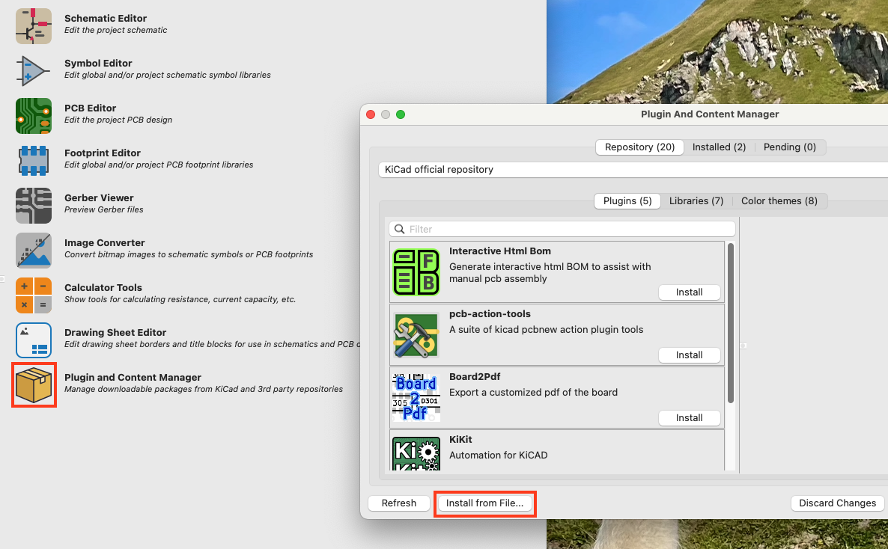

# AISLER Push for KiCad
### Push your layout to AISLER with just one click for instant Powerful Prototyping

Want to use Powerful Prototyping or Amazing Assembly from AISLER? This plugin will provide you with a convenient one-click push to our service.


When you click the AISLER Push-Button we will export your project's

- Gerber Files in the right format, so that production will run ultra-smooth
- IPC-Netlist-File to enable Smart Tests for production so that you get feedback down to the tiniest trace on how to improve your design for production
- BOM-file to import all components you have already assigned in your project 
- P'n'P-file to get your project ready for assembly

Once the upload (– which will only take a couple of seconds –) is complete you can place your order within less than one minute. If you iterate on your design and click the push button again, we will make sure your project is stored as a new revision of that same project on our server.


### Installation from the official KiCad repositories
Just open the "Plugin and Content Manager" from the KiCad main menu an install the "AISLER Push for KiCad" plugin from the selection list. That's it!

### Manual installation
If you prefere the latest version of this plugin, download the latest release ZIP file from https://github.com/AislerHQ/PushForKiCad/releases, within KiCad open the "Plugin and Content Manager" from the main window. Install the ZIP file using "Install from File..." a the bottom of the window.


### Note for flatpak installations
The KiCad flatpak does not contain the `requests` python module required by the plugin. In order to install the module, run the following commands:

```bash
flatpak run --command=sh org.kicad.KiCad
python -m ensurepip --upgrade
pip3 install requests
```

More information is given in the related [GitHub comment](https://github.com/Bouni/kicad-jlcpcb-tools/issues/94#issuecomment-1003599539).

### How do revisions work?
On the initial push of a new layout, the plugin adds a comment to comment line 3 including a reference to the corresponding AISLER Project ID.

Each further push will add the current layout to the project as a new revision. If this is not desired, just remove the comment and a new project will be created.

### How to automatically assign parts?
In order to speed up the development to production process we support the automated matching of parts. Just add a property named either "Mpn", "MPN", "mpn" or "AISLER_MPN" to your schematic symbol properties and use the MPN of the part as value.


### How to export data locally
Due to company-wide firewall restrictions, direct upload may not work. In this case, it is possible to export all data locally as a ZIP file, which can then be uploaded manually.
To enable this option, open the "Board Setup", select "Text Variables", and add a new variable called "aisler_export_locally". The value itself does not matter. Once this is set, the plugin will place a ZIP file next to the kicad_pcb file instead of uploading it directly.
If you want to specify a custom location for the local export relative to the project directory, you can add another text variable called "aisler_local_export_path". The value of this variable specifies the target directory relative to your project location.
If it is left empty, the plugin will place the ZIP file next to the kicad_pcb file. If you enter "\Fabrication", for example, the plugin will create a folder called "Fabrication" next to the kicad_pcb file and place the ZIP file in that folder.

### About AISLER
AISLER makes hardware less hard by providing simple electronics manufacturing for everyone. We are based in Europe and focus on amazingly affordable prices, super swift delivery and outstanding customer support. We are KiCad Platinum Sponsor as we donate a significant amount of our revenues made from KiCad designs back to the project.

[](https://aisler.net?mtm_campaign=github_pushforkicad)

[](https://aisler.net?mtm_campaign=github_pushforkicad)
