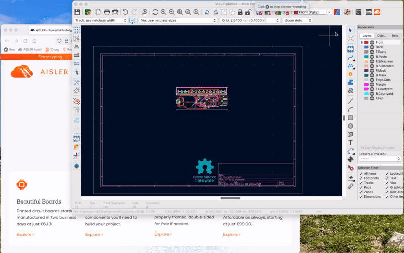
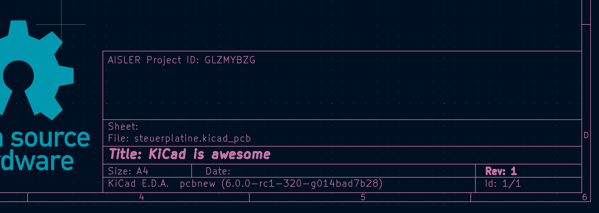
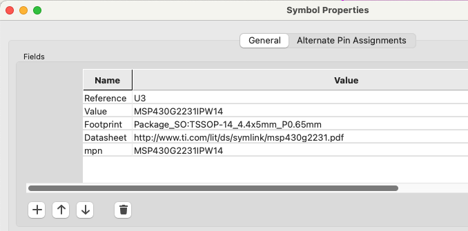

# AISLER Push for KiCad
### Push your layout to AISLER with just one click for instant Powerful Prototyping

Want to use Powerful Prototyping or Amazing Assembly from AISLER? This plugin will provide you with a convenient one-click push to our service.

When you click the AISLER Push-Button we will export your project's

- Gerber Files in the right format, so that production will run ultra-smooth
- IPC-Netlist-File to enable Smart Tests for production so that you get feedback down to the tiniest trace on how to improve your design for production
- BOM-file to import all components you have already assigned in your project 
- P'n'P-file to get your project ready for assembly

Once the upload (which will only take a couple of seconds) is complete you can place your order within less than one minute. If you iterate on your design and click the push button again, we will make sure your project is only stored as a new revision on our server.

### Installation
Download the latest release ZIP file from https://github.com/AislerHQ/PushForKiCad/releases, within KiCad open the "Plugin and Content Manager" from the main window. Install the ZIP file using "Install from File..." a the bottom of the window.

### How do revisions work?
On the initial push of a new layout the plugin adds a comment to comment line 3 inclduing a reference to the corresponding AISLER Project ID.

Each further push will add the current layout to the project as a new revision. If this is not desired, just remove the comment and a new project will be created.

### How to automatically assign parts?
In order to speed up the development to production process we support the automated matching of parts. Just add a property named either "Mpn", "MPN", "mpn" or "AISLER_MPN" to your schematic sympbol properties and use the MPN of the part as value.

### About AISLER
AISLER makes hardware less hard by providing simple electronics manufacturing for everyone. We are based in Europe and focus on amazingly affordable prices, super swift delivery and outstanding customer support. We are KiCad Platinum Sponsor as we donate a significant amount of our revenues made from KiCad designs back to the project.

